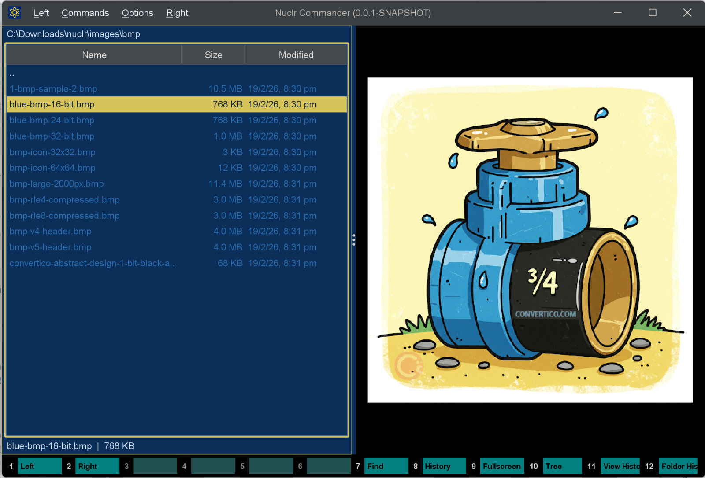
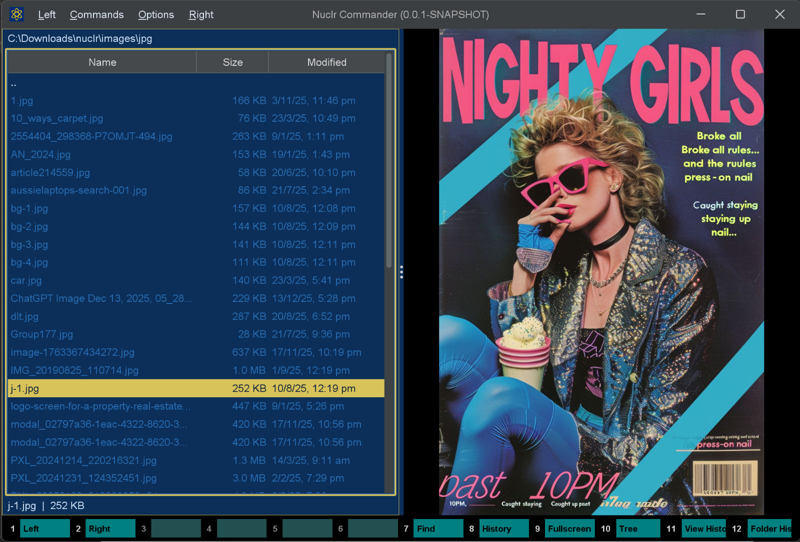
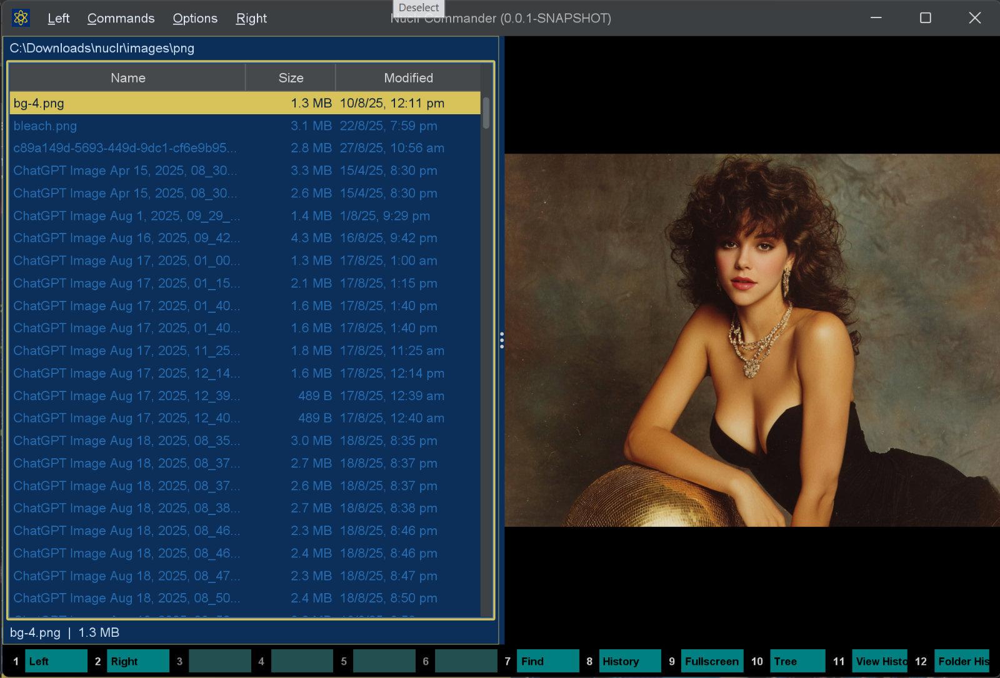

# 🖼️ Image Quick Viewer

A lightweight [Nuclr Commander](https://nuclr.dev) plugin for instant image preview in the Quick View pane. Uses Java's built-in image decoding — no external tools or native dependencies required.

## 📸 Screenshots





## ✨ What it does

| Feature | Details |
|---|---|
| ⚡ Instant preview | Opens images immediately when selected in Quick View |
| 📐 Fit-to-panel | Images are scaled to fill the panel while preserving aspect ratio; no upscaling |
| 🔍 Zoom | Ctrl+scroll to zoom in and out (1× to 16×); zoom indicator shown in corner |
| 🖱️ Pan | Drag with the left mouse button when zoomed to pan around the image |
| ℹ️ Image info overlay | Toggle a semi-transparent panel showing dimensions, file size, and EXIF (camera, exposure, ISO, GPS…) |
| 📋 Context menu | Right-click to copy image, copy file, copy path, toggle image info, or open in Explorer |
| ⛔ Cancellable load | Switching files immediately cancels the in-flight load; no stale images |
| ⚠️ Error messages | Clear on-panel messages for unreadable or corrupt files |

### 🔍 Zoom and pan controls

| Input | Action |
|---|---|
| `Ctrl` + scroll wheel up | Zoom in |
| `Ctrl` + scroll wheel down | Zoom out |
| Left mouse drag | Pan (only when zoomed in) |
| Open any new file | Reset zoom and pan |

> 💡 Snaps to 100% (actual pixels) when the on-screen scale passes through 1:1 for easy sharpness checking.

### ℹ️ Image info overlay

Tick the **ⓘ Info** checkbox in the bottom-left corner (or right-click → **Show image info**) to overlay a semi-transparent panel with the image's metadata: dimensions, file size, format, and — when present — EXIF details such as camera make/model, lens, capture date, exposure, aperture, ISO, focal length, orientation, and GPS coordinates. Metadata is read with the [Metadata Extractor](https://github.com/drewnoakes/metadata-extractor) library.

## 🧩 Supported formats

| Extension | Format |
|---|---|
| `.jpg` / `.jpeg` | JPEG |
| `.png` | PNG |
| `.gif` | GIF (first frame) |
| `.bmp` | Windows Bitmap |

> 🔧 For broader format support (WebP, SVG, RAW, TIFF, and more), use the **ImageMagick Bridge** plugin alongside this one.

## 📥 Installation

Copy the signed plugin archive and detached signature into the Nuclr Commander `plugins/` directory:

```text
quick-view-image-<version>.zip
quick-view-image-<version>.zip.sig
```

Nuclr Commander verifies the RSA-SHA256 signature against `nuclr-cert.pem` on load. The plugin becomes available immediately without a restart.

## ⚙️ How it works

Images are read via `ImageIO.read` wrapped in a `CancelableInputStream` that monitors the cancellation flag so switching files during a slow load aborts immediately. The fit-to-panel scale is computed as `min(panelW/imgW, panelH/imgH)` capped at 1.0 to avoid upscaling. The user zoom multiplier is applied on top; at 16× the cursor switches to a move cursor to indicate panning is available.

## 🗂️ Source layout

```text
src/main/java/dev/nuclr/plugin/core/quick/viewer/
├── ImageQuickViewProvider.java   plugin entry point
├── ImageViewPanel.java           Swing panel, rendering, zoom/pan logic, info overlay
├── ImageInfo.java                EXIF / metadata extraction for the info overlay
└── CancelableInputStream.java    cancellation-aware image loading
```

## 📚 Dependencies

Most dependencies are provided by Nuclr Commander at runtime; the metadata library (and its `xmpcore` transitive dependency) is bundled in the plugin ZIP for the info overlay.

| Library | Version | Purpose |
|---|---|---|
| `dev.nuclr:platform-sdk` | `3.0.2` | Nuclr platform interfaces |
| `com.drewnoakes:metadata-extractor` | `2.20.0` | EXIF / image metadata extraction (bundled) |

## 📜 License

Apache License 2.0 — see [LICENSE](LICENSE).
